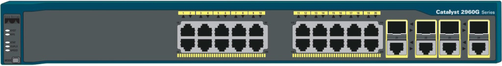
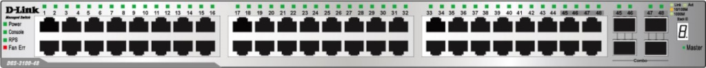
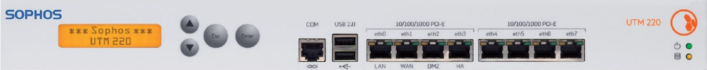
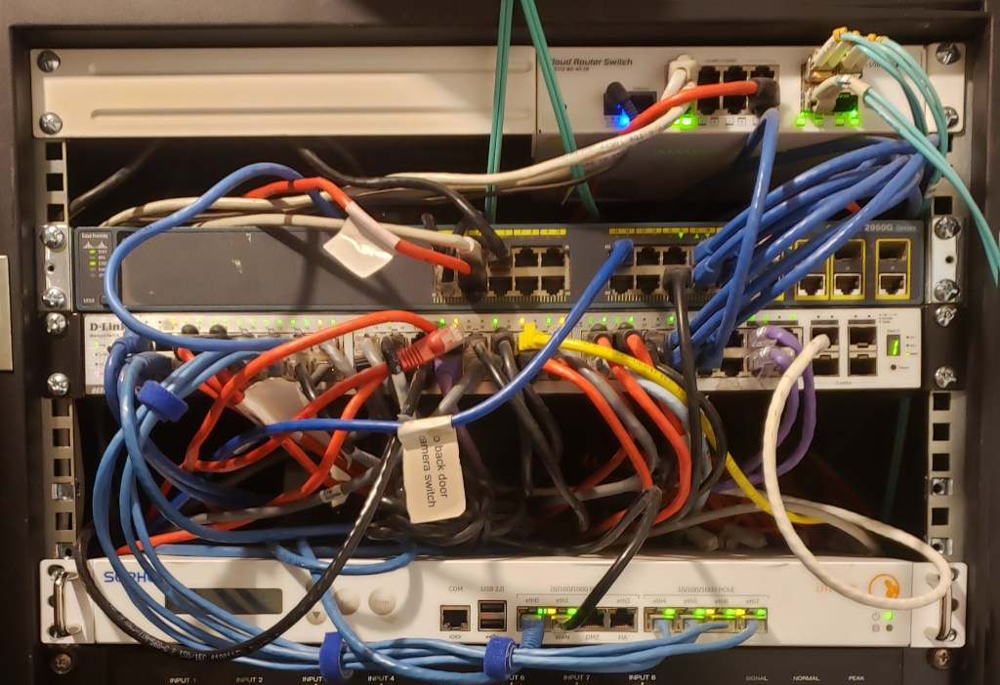

<html>
<head>
<title>ProtoSpace Rack</title>
<meta name="viewport" content="width=device-width, initial-scale=1">
<link rel="stylesheet" href="https://www.w3schools.com/w3css/4/w3.css">
</head>
<body>

<h1>Rack</h1>
 
 
 
 
 
 
 
 
 

</body>
</html>